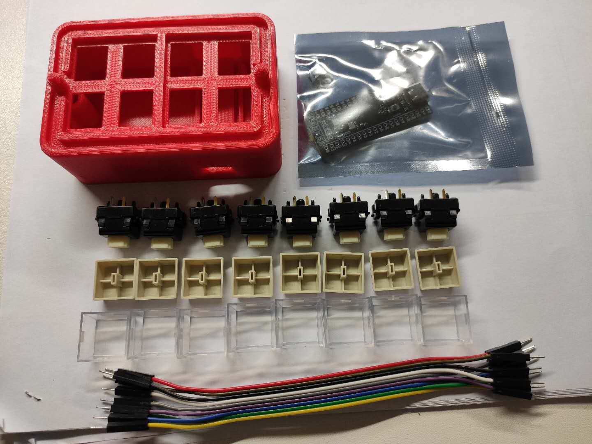
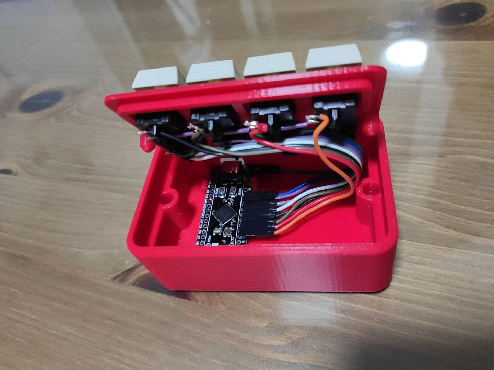
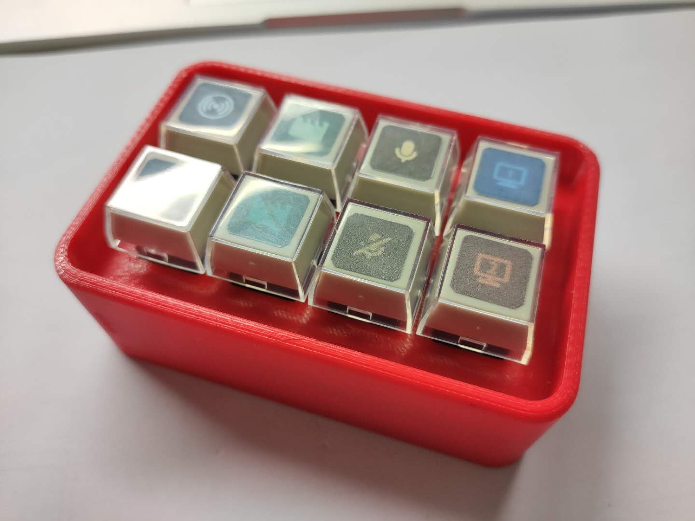

**OBS-Deck**

在SARS2病毒发作期间，居家隔离，实在是没有太多的事情可以做。所以尝试设计了一个用于OBS流播的小键盘。

用了一片基于STM32F401CC的单片机（BlackPill），8个机械键以及一些导线。

壳子采用FreeCAD设计，为了方便安装，采用自锁紧方式设计，只要扣起来即可。

开发程序采用Platformio + SMT32Duino，框架还是基于Arduino，因为开发简单啊。

这里附上壳子的STL以及STEP文件，以及程序源代码。

3/23 新增加Slim版本。

